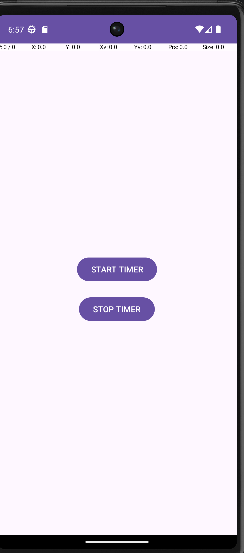
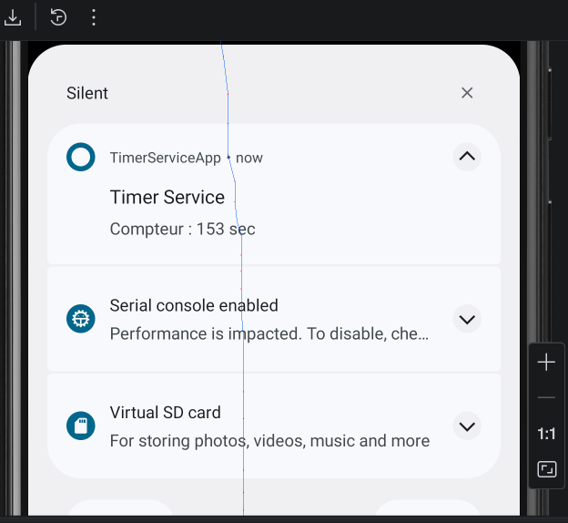

# LAB 16 : Maîtriser les Services dans une Application Android

## Introduction

Dans ce laboratoire, j’ai développé une application Android utilisant un **Foreground Service** en Java.

L’objectif était de comprendre :
- le fonctionnement des Services Android,
- les notifications persistantes,
- les tâches en arrière-plan,
- et la gestion des permissions Android modernes.

L’application réalisée est un chronomètre qui continue à fonctionner même lorsque l’application est minimisée.

---

# 1. Objectifs du laboratoire

Les objectifs étaient :

- Créer un Service Android
- Utiliser un Foreground Service
- Afficher une notification persistante
- Comprendre le cycle de vie d’un Service
- Gérer les permissions Android 13/14

---

# 2. Création du projet

Le projet a été créé avec les paramètres suivants :

| Paramètre | Valeur |
|---|---|
| Nom du projet | TimerServiceApp |
| Langage | Java |
| SDK minimum | API 24 |

---

# 3. Création du Service

J’ai créé une classe :

```text
TimerBackgroundService
```

Cette classe hérite de :

```java
Service
```

Le service :
- démarre un chronomètre,
- incrémente un compteur chaque seconde,
- affiche une notification persistante,
- continue à fonctionner en arrière-plan.

Le timer est géré avec :

```java
TimerTask
```

---

# 4. Configuration du Manifest

Dans le fichier :

```text
AndroidManifest.xml
```

j’ai ajouté les permissions nécessaires :

```xml
<uses-permission android:name="android.permission.POST_NOTIFICATIONS"/>
<uses-permission android:name="android.permission.FOREGROUND_SERVICE"/>
<uses-permission android:name="android.permission.FOREGROUND_SERVICE_DATA_SYNC"/>
```

Déclaration du service :

```xml
<service
    android:name=".TimerBackgroundService"
    android:foregroundServiceType="dataSync"
    android:exported="false"/>
```

---

# 5. Création de l’interface

L’interface contient :
- un bouton START TIMER,
- un bouton STOP TIMER.

Le bouton START démarre le service.

Le bouton STOP arrête le service.

---

# 6. Fonctionnement de l’application

## Démarrage

Quand l’utilisateur clique sur :

```text
START TIMER
```

le service :
1. démarre en arrière-plan,
2. lance le chronomètre,
3. affiche une notification persistante.

## Arrêt

Quand l’utilisateur clique sur :

```text
STOP TIMER
```

le service s’arrête et la notification disparaît.

---

# 7. Difficultés rencontrées

Durant ce laboratoire, plusieurs problèmes ont été rencontrés :
- crash du Foreground Service,
- permissions Android 14,
- problèmes liés aux notifications,
- erreurs dans le Manifest.

Ces problèmes ont été corrigés en :
- ajoutant les permissions nécessaires,
- configurant correctement le foregroundServiceType,
- utilisant NotificationChannel.

---

# 8. Résultat final

L’application fonctionne correctement :
- le service démarre sans erreur,
- la notification apparaît,
- le chronomètre fonctionne en arrière-plan,
- le bouton STOP arrête le service.

---

# 9. Captures d’écran

## Interface principale



## Notification du timer



---

# Conclusion

Ce laboratoire m’a permis de comprendre le fonctionnement des Services Android et des Foreground Services.

J’ai appris :
- la gestion des tâches en arrière-plan,
- l’utilisation des notifications persistantes,
- la gestion des permissions Android modernes,
- et le fonctionnement du cycle de vie d’un Service.
